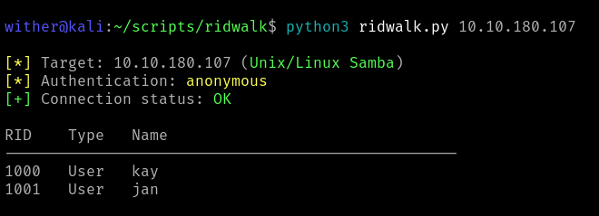

# ridwalk

[](https://opensource.org/licenses/MIT)
[](https://www.python.org/downloads/)
[](https://github.com/wither/ridwalk)
[](https://github.com/wither/ridwalk/stargazers)
[](https://github.com/wither/ridwalk/issues)



A fast RID cycling tool for SMB enumeration on Windows AD and Unix/Linux Samba 

## Table of Contents

- [Features](#features)
- [Installation](#installation)
- [Usage](#usage)
- [Command Line Options](#command-line-options)
- [Sample Output](#sample-output)
- [Troubleshooting](#troubleshooting)
- [Roadmap](#roadmap)
- [Technical Notes](#technical-notes)
- [Disclaimer](#disclaimer)

## Features

- RID cycling enumeration for user and group discovery
- Automatic target detection (Windows AD / Unix Samba)
- Multi-threaded scanning with configurable thread count
- Anonymous and authenticated enumeration modes

## Installation

### Prerequisites

- Python 3.8 or higher
- Samba tools (`rpcclient`)
- Network access to target SMB services

### Install Dependencies

1. **Install Samba tools**
   ```bash
   # Ubuntu/Debian
   sudo apt install smbclient
   
   # macOS
   brew install samba
   
   # Windows (WSL)
   sudo apt install smbclient
   ```

2. **Clone the repository**
   ```bash
   git clone https://github.com/wither/ridwalk.git
   cd ridwalk
   ```

3. **Set permissions**
   ```bash
   chmod +x ridwalk.py
   ```

## Usage

```bash
# Anonymous enumeration
./ridwalk.py 10.10.10.10

# Prompt for password
./ridwalk.py 10.10.10.10 -U administrator

# Custom RID range
./ridwalk.py 10.10.10.10 -r 500-2000

# Users only with specific range
./ridwalk.py 10.10.10.10 -u -r 1000-2000

# Authenticated scan with output file
./ridwalk.py 10.10.10.10 -U admin -o results.txt

# Multi-range enumeration with verbose output
./ridwalk.py 10.10.10.10 -r 500-600,1000-1100 -v

# High-performance scanning
./ridwalk.py 10.10.10.10 -t 30 -r 500-1500
```

## Command Line Options

```
./ridwalk.py <target> [options]

Arguments:
  target                SMB server IP address

Options:
  -r, --range           RID range (default: 1000-1050)
  -t, --threads         Thread count (default: 10, max: 50)
  -U, --username        Authentication username
  -P, --password        Authentication password
  -u, --users           Enumerate users only
  -g, --groups          Enumerate groups only
  -o, --output          Save results to file
  -v, --verbose         Detailed progress output
  -q, --quiet           Minimal output mode
  --version             Display version information
```

## Sample Output

```
[*] Target: 10.10.10.10 (Windows AD)
[*] Authentication: anonymous
[*] Domain SID: S-1-5-21-1234567890-987654321-1122334455

RID    Type   Name
--------------------------------------------------
500    User   Administrator
512    Group  Domain Admins
1001   User   alice
1002   User   bob
```

## Troubleshooting

**"rpcclient not found"**  
Install samba tools: `sudo apt install smbclient`

**"Connection refused"**  
Verify SMB service is running and accessible

**"Authentication failed"**  
Check credentials or try anonymous mode

## Roadmap

- [ ] **Multiple export formats**
- [ ] **Proxy support**
- [ ] **Configuration files**
- [ ] **CIDR scanning**
- [ ] **Stealth options**
- [ ] **Username validation**

See the [open issues](https://github.com/wither/ridwalk/issues) for a full list of proposed features and known issues.

## Technical Notes

- Effectiveness depends on target SMB configuration and security controls
- Modern systems may implement RID cycling protections
- High thread counts may trigger rate limiting or detection mechanisms
- Tool performance varies based on network latency and target responsiveness

## Disclaimer

**This tool is intended for authorized security testing and penetration testing only.**

Users must obtain explicit written permission before scanning any systems. The authors assume no liability for misuse of this software. Use responsibly and in compliance with all applicable laws and regulations.
